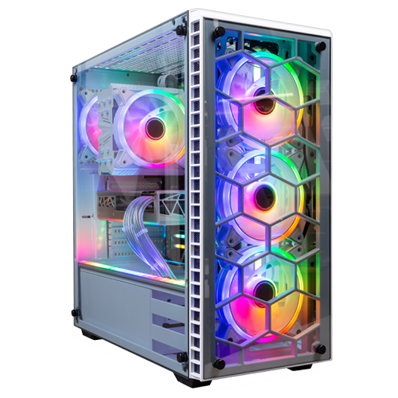

# React Bootstrap Cart App

This project was bootstrapped with [Create React App](https://github.com/facebook/create-react-app).

## Project Structure

The project structure is organized as follows:

```
├── public
│   ├── favicon.ico
│   ├── index.html
│   ├── logo192.png
│   ├── manifest.json
│   └── robots.txt
├── src
│   ├── components
│   │   ├── Cart.jsx
│   │   ├── Footer.jsx
│   │   ├── Header.jsx
│   │   └── Product.jsx
│   ├── images
│   │   ├── Cooler.jpg
│   │   ├── Graphiccard.jpg
│   │   ├── IntelCorei7-13700K.jpg
│   │   ├── memoram1.jpg
│   │   ├── SoundBlasterXG.jpg
│   │   └── ssdgamer.jpg
│   ├── App.css
│   ├── App.js
│   ├── App.test.js
│   ├── index.css
│   ├── index.js
│   ├── reportWebVitals.js
│   ├── setupTests.js
├── .gitignore
├── package.json
├── package-lock.json
└── README.md 
```

## About Project



This project is a React Bootstrap Cart that allows users to add products to a cart.

## How to view the project?

[https://voluble-youtiao-9bc0f9.netlify.app/](https://voluble-youtiao-9bc0f9.netlify.app/)

### Thanks! 🙌

#### Used technology

[](https://html.com/)
[](https://www.w3.org/Style/CSS/Overview.en.html)
[](https://www.javascript.com/)

[](https://en.react.dev/)
[](https://getbootstrap.com)

[](https://www.sublimetext.com/)
[](https://www.jetbrains.com/phpstorm/)
[](https://visualstudio.microsoft.com/)
